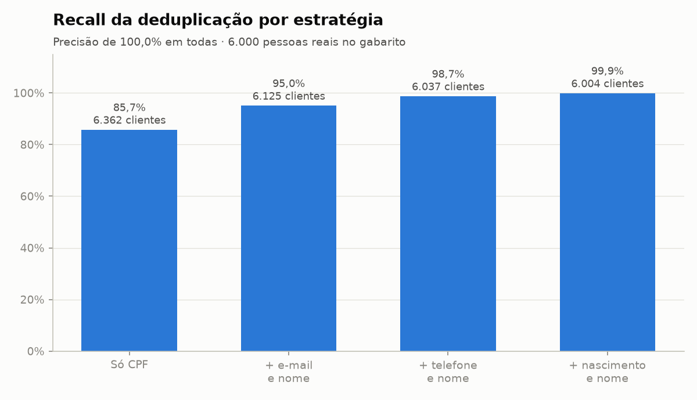
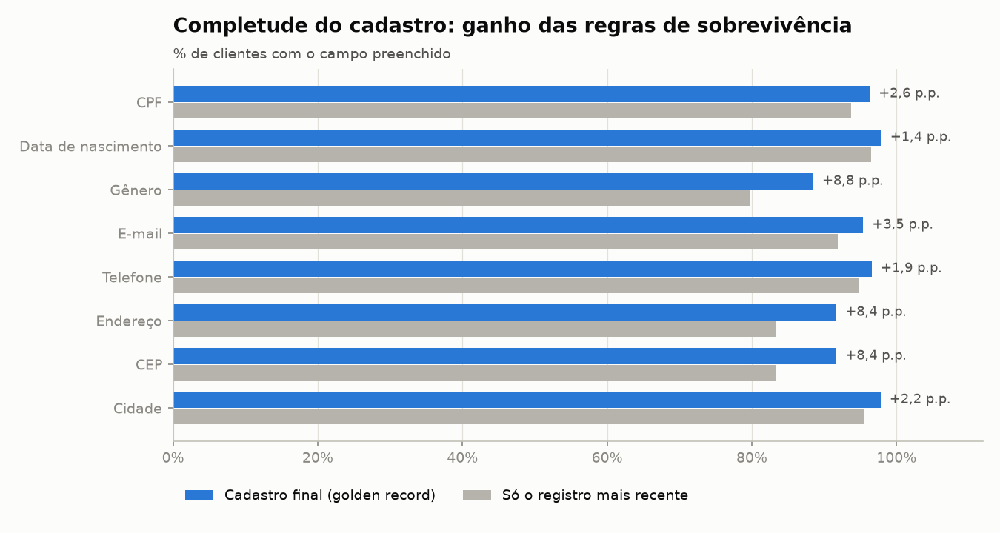
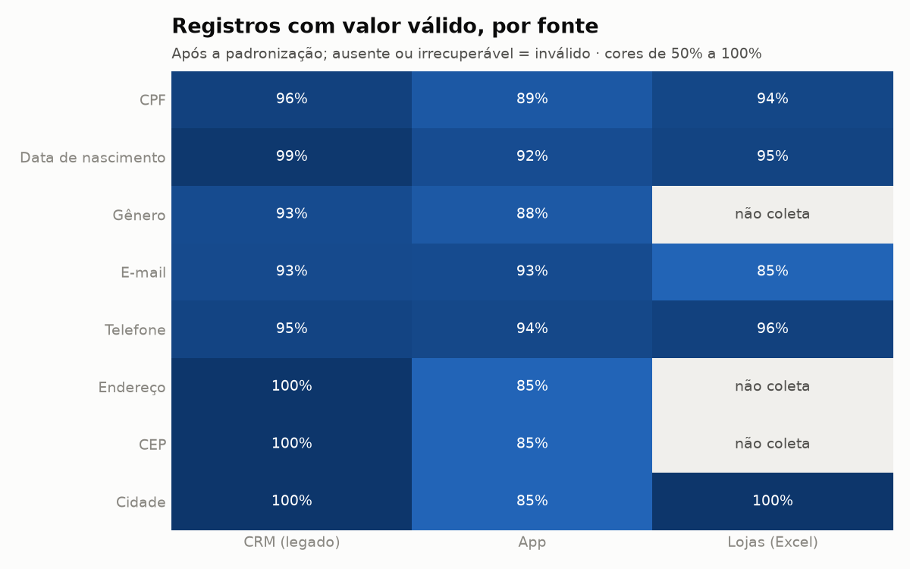
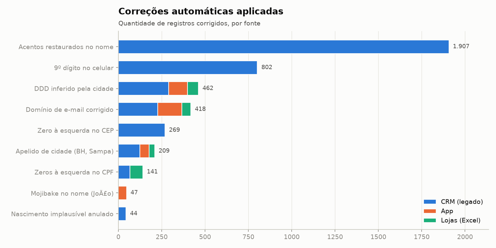
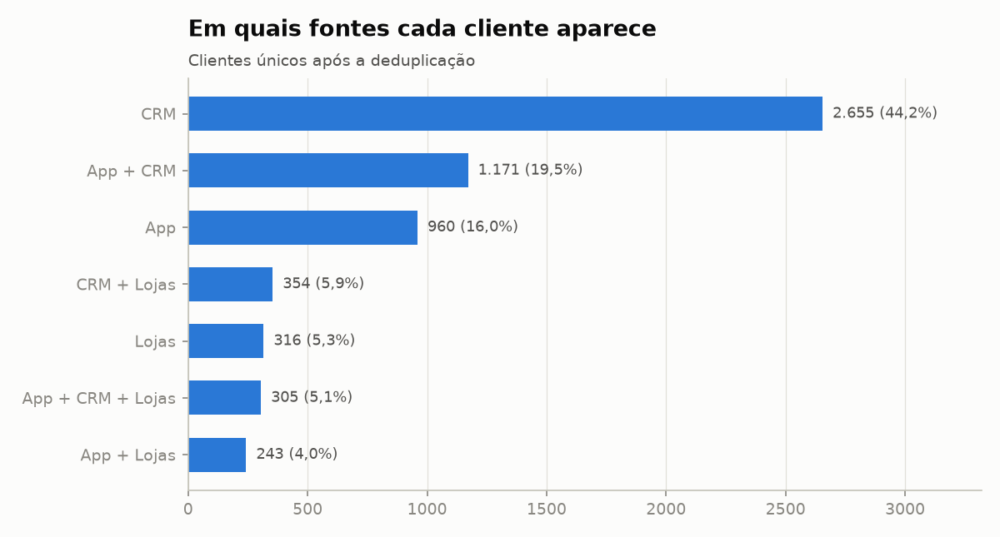
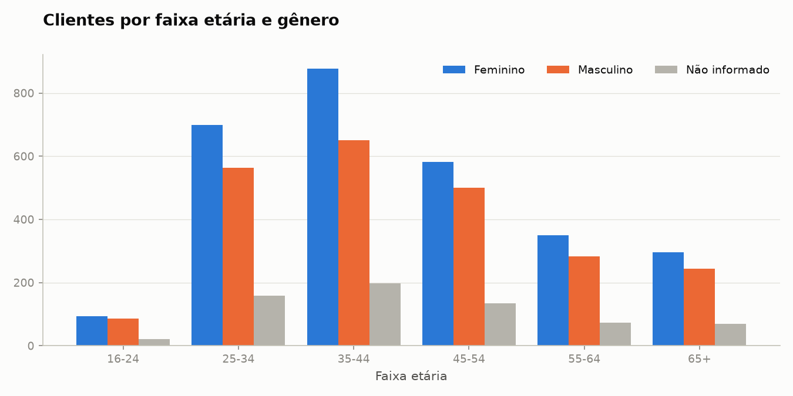

# 02 · Customer Data Cleaning

Consolidação de cadastros de clientes vindos de **três sistemas diferentes** em um
**cadastro único e confiável** (*golden record*), com padronização campo a campo,
validação de documentos, **deduplicação exata e aproximada** e medição da qualidade
do resultado contra um gabarito. Feito em Python + Pandas.

```text
CRM (CSV latin-1) ─┐
App (JSON Lines) ──┼─ extração ─ padronização ─ deduplicação ─ golden record
Lojas (Excel) ─────┘       │                                        │
                        quarentena                       validação ─ avaliação
                                                                    │
                  cadastro único · mapa registro→cliente · base de marketing (LGPD)
                                  relatório · 13 CSVs · 6 gráficos
```

**Nível:** 2 (strings, datas, validações e regras de negócio) · **Stack:** Python 3.11+, Pandas, NumPy, openpyxl, Matplotlib, pytest

---

## Problema e contexto

A rede **Farmácias Bem Viver** comprou a concorrente **Drogaria Popular** e precisa de
uma base única de clientes para programa de fidelidade e campanhas. Os clientes estão em três lugares:

| Fonte | Sistema | Formato | Registros | Particularidades |
|---|---|---|---|---|
| `crm_clientes.csv` | CRM legado da Bem Viver | CSV `;` em **latin-1** | 4.738 | CAIXA ALTA, sem acentos, endereço em um único texto, celulares antigos com 8 dígitos |
| `app_cadastros.jsonl` | App da Drogaria Popular | **JSON Lines**, endereço aninhado | 2.759 | CPF opcional, nomes com *mojibake* (`João`), telefone com +55 |
| `lojas_cadastros.xlsx` | Planilhas das lojas | **Excel**, uma aba por loja | 1.284 | título acima do cabeçalho, CPF digitado como número, datas em 3 formatos |

A mesma pessoa pode estar nas três fontes e até duas vezes na mesma fonte, escrita de formas
diferentes e com dados desatualizados. Não existe uma chave comum confiável: o CPF falta,
está corrompido ou foi digitado errado em parte dos registros.

## Objetivo

1. Padronizar os campos de todas as fontes em um esquema comum.
2. Descobrir quais registros são a mesma pessoa, sem unir pessoas diferentes.
3. Montar um registro por cliente com a melhor informação disponível.
4. Entregar uma base de marketing que respeite o consentimento (LGPD).
5. **Medir** a qualidade da deduplicação e do cadastro final.

## Origem dos dados

Dados **sintéticos** gerados por [`scripts/generate_data.py`](scripts/generate_data.py) (semente fixa).
O gerador cria 6.000 pessoas "reais", decide em quais fontes cada uma aparece e escreve cada
registro do jeito daquela fonte, com ruído. Ele também grava um **gabarito**
(`data/external/`), que diz qual pessoa está por trás de cada registro. O pipeline **não usa**
o gabarito na limpeza, apenas para avaliar o resultado no final.

> CPFs, nomes e contatos são aleatórios e não pertencem a pessoas reais.

## Problemas encontrados (e inseridos de propósito)

| Tipo | Exemplos reais do dataset |
|---|---|
| Codificação | CRM em latin-1; nomes do app com *mojibake*: `João`, `Conceição` |
| Acentos perdidos | `BRANDAO`, `OTAVIO ARAUJO` (sistema legado) |
| Títulos e abreviações | `Sra. Renata Alves`, `Maria S. Oliveira` |
| Erros de digitação | `Henrique Aarújo`, e-mails `@gmial.com`, `@hotmail.con`, `@yahoo.com.bt` |
| CPF | `529.982.247-25`, `52998224725`, `2998224725` (zero perdido), `5,29982E+10` (notação científica), dígito errado, `000.000.000-00` |
| Telefone | `(11) 98765-4321`, `+5511987654321`, `011987654321`, `98765-4321` (sem DDD), `(11) 8765-4321` (sem o 9) |
| Datas | `12/04/1985`, `1985-04-12`, célula de data do Excel, serial `31149`, `12/04/85`, placeholder `01/01/1900` |
| Cidade/UF | `SAO PAULO`, `Sampa`, `BH`, `Campinas - SP`, UF por extenso ou ausente |
| Endereço | `R. DAS FLORES, Nº 123 - APTO 12` em um só campo; `Av`, `AV.`, `Pç.`, `PRACA` |
| CEP | `01310-100`, `1310100` (zero perdido) |
| Placeholders | `naotem@naotem.com`, `sem@email.com`, `nao possui`, `-` |
| Registros falsos | `TESTE SISTEMA`, `CONSUMIDOR FINAL`, `CLIENTE BALCAO` |
| Duplicidades | dentro da mesma fonte e entre fontes; registros antigos com e-mail, telefone e endereço desatualizados |
| Armadilha | 40 famílias **compartilham o mesmo e-mail** (não podem ser unidas) |

## Processo de tratamento — principais decisões

### Padronização ([`src/standardize.py`](src/standardize.py))

| Decisão | Por quê |
|---|---|
| Cada correção gera uma flag `corr_*` | Dá para contar e auditar tudo que foi alterado automaticamente. |
| CPF com 9–10 dígitos recebe zeros à esquerda | Foi salvo como número. Se o palpite estiver errado, os **dígitos verificadores** reprovam. |
| CPF em notação científica é `ilegivel` | O Excel arredondou os últimos dígitos, que não podem ser recuperados. |
| *Mojibake* desfeito com `encode("latin-1").decode("utf-8")` | Reverte exatamente a decodificação errada. Nomes legítimos como `ASSUNÇÃO` não são afetados. |
| **Acentos restaurados por vocabulário aprendido da base** | `explode` das palavras + `groupby`: `Brandao` vira `Brandão` se essa grafia aparece ≥ 3 vezes em outras fontes. Levou o nome correto de **77% para 95%**. |
| Celular com 8 dígitos ganha o 9 | Regra da Anatel. Só se aplica quando o número começa com 6–9. |
| Telefone sem DDD recebe o DDD **mais comum da cidade** | O DDD vem da própria base, sem tabela externa. |
| Domínios de e-mail com typo são corrigidos por dicionário; placeholders viram nulo | `ana@gmial.com` é recuperável; `sem@email.com` não é um contato. |
| Datas mistas do Excel (célula, serial, texto) | `pd.to_datetime(unit="D", origin="1899-12-30")` para seriais. Para ano com 2 dígitos, o século é escolhido para a data não cair no futuro. |
| Idade fora de 16–110 anos vira nulo | Pega `01/01/1900` e erros grosseiros. |
| Gênero **não** é inferido pelo nome | Seria uma suposição sobre a pessoa. Fica "não informado". |
| `SP`/`RJ` no campo cidade = capital | Suposição documentada, válida para esta base. |

### Deduplicação ([`src/deduplicate.py`](src/deduplicate.py))

Comparar todos com todos seria 38 milhões de pares. Em vez disso:

1. **Blocking**: um *self-merge* do Pandas por chave gera só os pares que compartilham CPF, e-mail, telefone ou data de nascimento.
2. **Regras de match**:

   | Regra | Exige |
   |---|---|
   | `cpf` | mesmo CPF válido |
   | `email_e_nome` | mesmo e-mail **e** nome parecido (famílias dividem e-mail) |
   | `telefone_e_nome` | mesmo telefone **e** nome parecido |
   | `nascimento_e_nome` | mesmo nascimento **e** nome parecido **e** mesma cidade |

   A similaridade de nomes usa `difflib.SequenceMatcher` com limiar de 0,88. Nomes com o mesmo primeiro e último nome ganham um piso de 0,90, o que cobre abreviações.
3. **Não pode ligar**: CPFs válidos diferentes ou datas de nascimento diferentes nunca são unidos.
4. **Union-find** transforma os pares em grupos. Se A=B e B=C, os três são o mesmo cliente.

### Golden record ([`src/golden_record.py`](src/golden_record.py))

| Campo | Regra de sobrevivência |
|---|---|
| e-mail, telefone, gênero | valor não nulo **mais recente** (`sort_values` + `groupby().first()`) |
| endereço | **bloco inteiro** do registro mais recente que tem endereço (não mistura rua e CEP de registros diferentes) |
| data de nascimento | valor **mais frequente** |
| nome | sem abreviação > com acentos > mais recente |
| opt-in | resposta explícita mais recente; **sem resposta = sem consentimento** (LGPD) |
| empates | CRM > App > Lojas |

### Validação ([`src/validate.py`](src/validate.py))

São 12 regras **críticas**, que interrompem o pipeline: IDs e CPFs únicos, CPF/e-mail/telefone/CEP/UF válidos, idade plausível, todo registro mapeado para um cliente e nenhum cliente reunindo CPFs diferentes. Além delas, 4 **alertas**: clientes sem CPF, sem contato, sem nascimento e sem endereço.

## Arquitetura

```text
02-customer-data-cleaning/
├── main.py                    # orquestra as 7 etapas
├── scripts/generate_data.py   # gera fontes sujas + gabarito
├── src/
│   ├── config.py              # caminhos e parâmetros (limiar de similaridade, idades...)
│   ├── mappings.py            # de-para: domínios, UFs, apelidos de cidade, logradouros
│   ├── utils.py               # texto, datas mistas, formatação
│   ├── validators.py          # CPF (dígitos verificadores), e-mail, telefone, CEP
│   ├── extract.py             # read_csv (latin-1) · read_json (lines) · read_excel (todas as abas)
│   ├── standardize.py         # padronização campo a campo + quarentena
│   ├── deduplicate.py         # blocking, regras, similaridade, union-find
│   ├── golden_record.py       # sobrevivência por campo
│   ├── validate.py            # regras críticas e alertas
│   ├── evaluate.py            # precisão/recall e acurácia contra o gabarito
│   ├── analyze.py             # métricas de qualidade e perfil
│   ├── load.py                # exportação + base de marketing (LGPD)
│   ├── report.py              # output/relatorio.md
│   └── visualize.py           # 6 gráficos
├── tests/                     # 26 testes (unidade + ponta a ponta)
├── data/
│   ├── raw/                   # 3 fontes (versionadas)
│   ├── external/              # gabarito (apenas para avaliação)
│   └── processed/             # saídas (geradas)
└── output/
    ├── relatorio.md
    ├── reports/               # 13 CSVs
    └── charts/                # 6 PNGs
```

### Saídas (`data/processed/`)

| Arquivo | Conteúdo |
|---|---|
| `clientes_unicos.csv` | golden record: 1 linha por cliente, com idade, faixa etária, completude e fontes |
| `mapa_registros_clientes.csv` | `origem + id_origem -> cliente_id` (permite atualizar os sistemas de origem) |
| `registros_padronizados.csv` | todos os registros limpos, com `cliente_id` e flags `corr_*` |
| `clientes_marketing.csv` | só opt-in + e-mail válido, campos mínimos e CPF mascarado (`***.982.247-**`) |
| `rejeitados.csv` | registros de teste/genéricos, com motivo |

## Tecnologias e recursos de Pandas

`read_csv(encoding="latin-1", sep=";")` · `read_json(lines=True)` · `json_normalize` ·
`read_excel(sheet_name=None, header=2)` · `concat(keys)` · `reindex` · `str.extract` com grupos
nomeados · `str.replace/fullmatch/zfill/split/repeat` · `explode` · `map` · `mask`/`where` ·
`to_datetime(unit="D", origin=...)` · `DateOffset` · `merge` (self-merge, `validate`) ·
`groupby` + `first`/`agg`/`transform`/`size` · `drop_duplicates` · `pivot_table` · `crosstab` ·
`pd.cut` · `factorize` · `np.select` · NumPy para os dígitos verificadores.

**Aprendizado do pandas 3:** o tipo `string` usa o motor de regex **RE2** (PyArrow), que não
aceita *backreferences* (`(\d)\1{10}`) nem *lookarounds*. A checagem de CPF com dígitos
repetidos usa `str.repeat`.

## Como executar

```bash
cd 02-customer-data-cleaning
python3 -m venv .venv && source .venv/bin/activate   # Windows: python -m venv .venv && .venv\Scripts\activate
pip install -r requirements.txt
```

```bash
python main.py
```

```bash
pytest
```

Regenerar as fontes e o gabarito (opcional, mesma semente):

```bash
python scripts/generate_data.py
```

A execução completa leva ~1,5 s.

## Resultados obtidos

Relatório completo: [`output/relatorio.md`](output/relatorio.md).

| Etapa | Quantidade |
|---|---|
| Registros brutos (CRM + App + Lojas) | 8.781 |
| Registros de teste rejeitados | 14 |
| Registros duplicados eliminados | 2.763 |
| **Clientes únicos** | **6.004** (gabarito: 6.000 pessoas) |
| Clientes elegíveis para marketing | 2.951 |
| Correções automáticas aplicadas | 4.299 |

### Qualidade da deduplicação (contra o gabarito)

| Estratégia | Precisão | Recall | Clientes |
|---|---|---|---|
| Só CPF | 100% | 85,7% | 6.362 |
| + e-mail e nome | 100% | 95,0% | 6.125 |
| + telefone e nome | 100% | 98,7% | 6.037 |
| **+ nascimento e nome** | **100%** | **99,9%** | **6.004** |



- Deduplicar só por CPF deixaria **362 clientes a mais** do que existem de verdade. As regras aproximadas reduzem isso para 4.
- Nenhuma pessoa diferente foi unida (precisão 100%), nem mesmo as 40 famílias que compartilham e-mail.
- As 4 pessoas restantes não têm nenhum dado em comum entre seus registros (ex.: CPF só em um, telefone diferente e sem nascimento no outro). Uni-las exigiria regras arriscadas.

### Qualidade do cadastro final

| Campo | Preenchido | Correto quando preenchido |
|---|---|---|
| CPF | 96,3% | 100% |
| Data de nascimento | 97,9% | 100% |
| E-mail | 95,4% | 99,1% |
| Telefone | 96,6% | 99,4% |
| CEP | 91,7% | 98,5% |
| Nome | 100% | 94,7% |

Os erros restantes vêm de clientes com um único registro desatualizado (e-mail/telefone
antigos) ou com typo no nome, sem outra fonte para corrigir.



Comparado a "manter só o registro mais recente" (a deduplicação ingênua), as regras de
sobrevivência aumentam a completude em até **8,8 p.p.** (gênero) e **8,4 p.p.** (endereço).

| | |
|---|---|
|  |  |
|  |  |

**Outros achados**

- 34,5% dos clientes aparecem em mais de uma fonte. App + CRM é a combinação mais comum (19,5%).
- O CRM concentra os problemas de legado: 802 celulares sem o nono dígito, 99 CPFs em notação científica e 1.907 nomes sem acento.
- As lojas não coletam endereço nem gênero, e 15% dos registros das planilhas não têm e-mail válido (vazio, placeholder ou inválido).

## Próximas evoluções

- Revisão manual assistida dos pares com similaridade entre 0,80 e 0,88 (fila de *data stewardship*).
- Validar CEP e cidade contra a base dos Correios.
- Processamento incremental: casar só os registros novos contra o cadastro existente.
- Persistir o cadastro e o mapa de IDs em banco SQL (projetos 10–12 da coleção).
